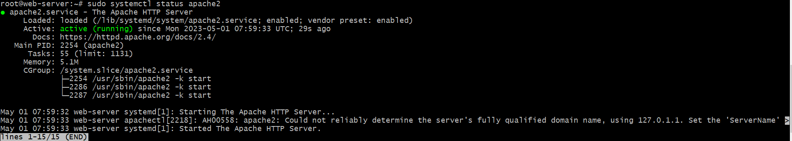
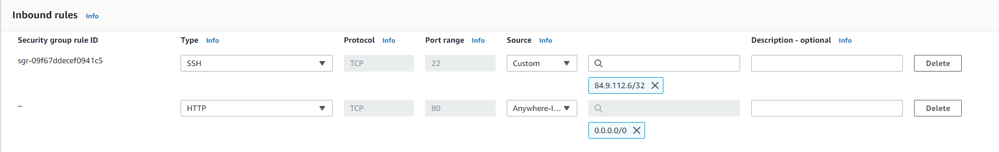
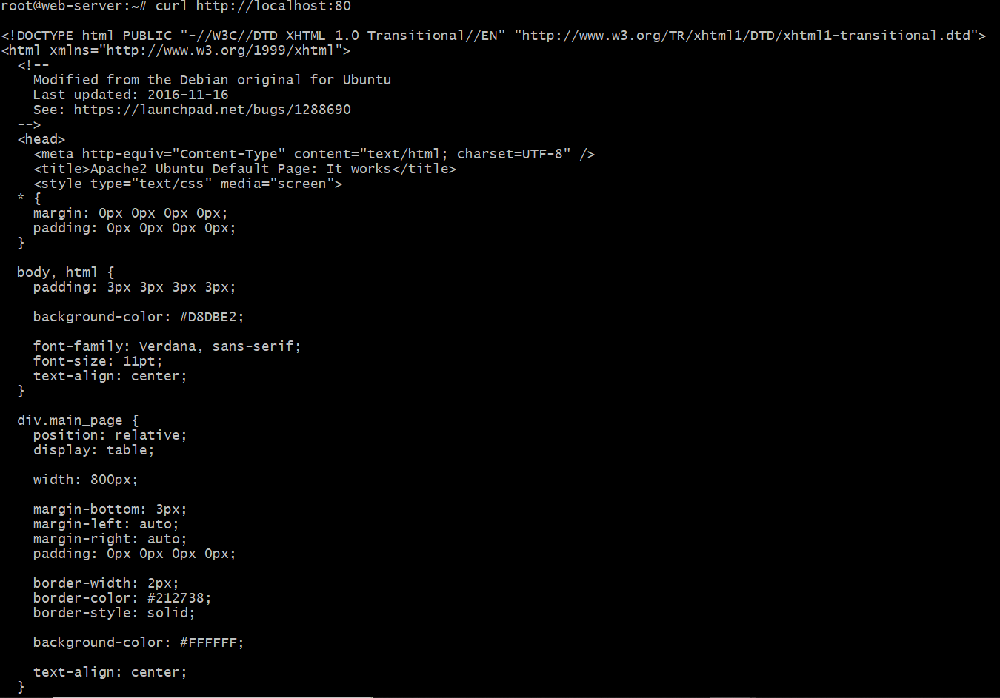
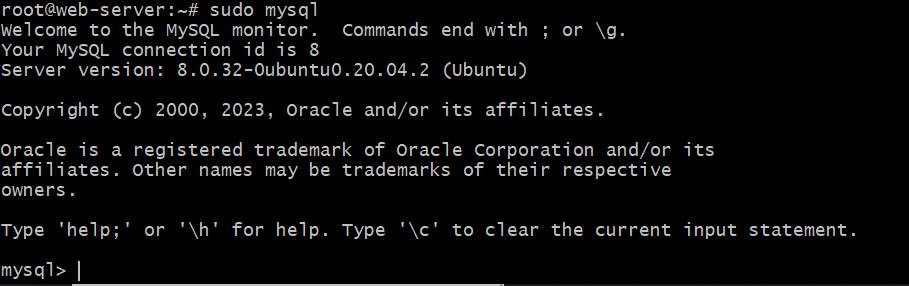
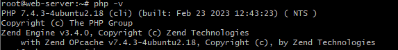
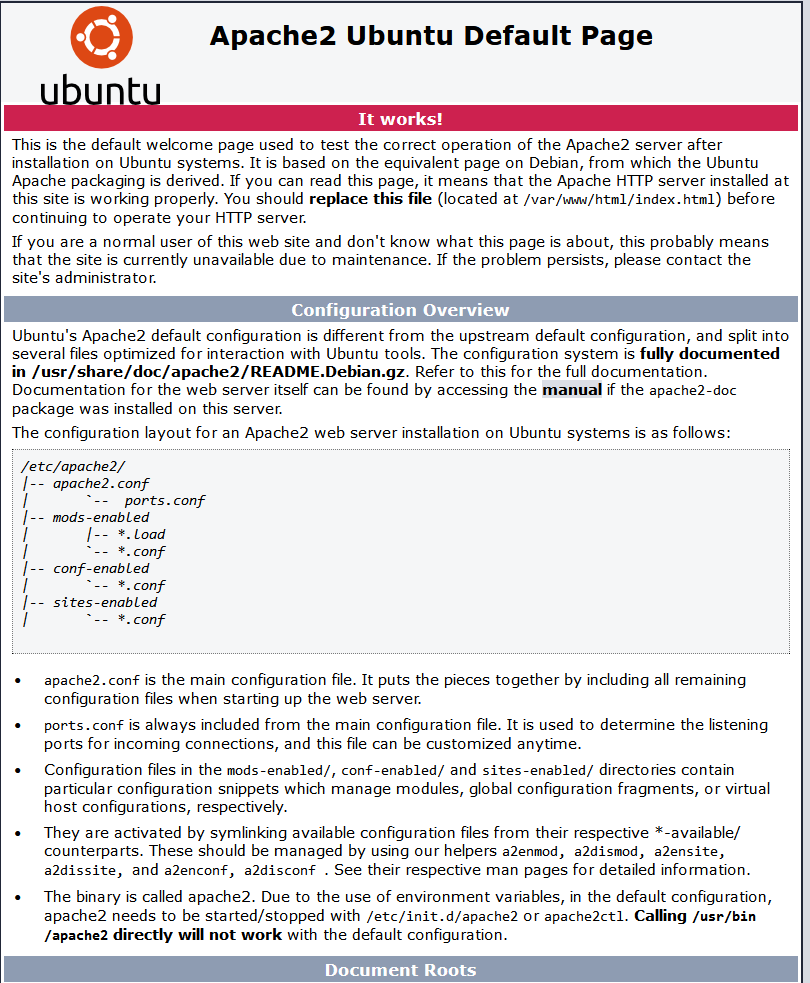

# LAMP STACK IMPLEMENTATION ON AWS

For this project, I will be dpeloying a LAMP STACK on AWS server instance.
LAMP - Linux, Apache, Mysql and PHP

## 1. INSTALLING APACHE AND UPDATING THE FIREWALL

To begin, I will be installing apache web server on the instance created on AWS. 

Before installing Apache, I need to update the list of packages in the package manager using the command: 
`sudo apt update`

For the installation, I will use the following command:
`sudo apt install apache2`

To verify that apache2 is running as a service, I used the following command:
`sudo systemctl status apache2`

The EC2 security group is configured to allow inbound connection via port 80:

Testing if it runs on the ubuntu shell using the following commands:
`curl http://localhost:80`
It displays the following output: 

Testing it out on my browser as well using 'http://<Public-IP>:80'

## 2. INSTALLING MYSQL

Now that the webserver is running, MySQL will be installed next. This is a relatoinal database used to store and manage data for websites.

The following command is used to install the software `sudo apt install mysql-server`

After installation, I confirmed the installation is complete and logged into the MySQL console using the command: `sudo mysql`

It dispalys the follwing output: 

After installation and validation, A password is set for the root user, using mysql_native_password as default authentication method with the following command: 
`ALTER USER 'root'@'localhost' IDENTIFIED WITH mysql_native_password BY '<insert_your_password>'`

The following command is recommended to remove some insecure default settings and lock down access to the database system. `sudo mysql_secure_installation`

## 3. INSTALLING PHP
Apache has been installed to serve your content and MySQL installed to store and manage your data. PHP is the component of our setup that will process code to display dynamic content to the end user. In addition to the php package, you'll need php-mysql, a PHP module that allows PHP to communicate with the MySQL-based databases. You'll also need libapache2-mod-php to enable Apache to handle PHP files. Core PHP packages will automatically be installed as dependencies.

To install these 3 packages at once we use the follwing code:
`sudo apt install php libapache2-mod-php php-mysql`

To check the version installed, I use `php -v`. 

The version is shown here: 

## 4. APACHE VIRTUAL HOST
Virtual host allows you to have multiple websites located on a single machine and users of the websites will not even notice it. 

### 4.1 CREATING VIRTUAL HOST FOR THE WEBSITE USING APACHE
A directory for lampproject is created using the command `sudo mkdir /var/www/lampproject`
I assign the ownership of the directory to my user using the command `sudo chown -R $USER:$USER /var/www/lampproject`
I created a new configuration file in apache's site-available directory using vim: `sudo vim /etc/apache2/site-available/lampproject.conf`
The following command config was pasted in the file: 
<VirtualHost *:80>
    ServerName lampproject
    ServerAlias www.lampproject
    ServerAdmin webmaster@localhost
    DocumentRoot /var/www/lampproject
    ErrorLog ${APACHE_LOG_DIR}/error.log
    CustomLog ${APACHE_LOG_DIR}/access.log combined
</VirtualHost>

The new virtualhost is enabled using `sudo a2ensite lampproject`

The default website that comes installed with Apache is disabled. This is required if you’re not using a custom domain name, because in this case Apache’s default configuration would overwrite your virtual host. To disable Apache’s default website use a2dissite command: `sudo a2dissite 000-default`

To make sure my config file does not contain any errors, the command is run: `sudo apache2ctl configtest` and then reload apache with `sudo systemctl reload apache2`

The website is now active but the web root /var/www/lampproject is still empty. I created an index.html file in that location so that we can test that the virtual host works as expected. 

validating the webserver is working: 

## 5. ENABLE PHP ON THE WEBSITE
The order in which the index.php file is listed within the directory index is changed using the command `sudo vim /etc/apache2/mods-enabled/dir.conf`. index.php becomes the first filename. 

<IfModule mod_dir.c>
        #Change this:
        #DirectoryIndex index.html index.cgi index.pl index.php index.xhtml index.htm
        #To this:
        DirectoryIndex index.php index.html index.cgi index.pl index.xhtml index.htm
</IfModule>

apache is reloaded `sudo systemctl reload apache2`

A test script is created to test that PHP is correctly installed and configured on the server. 
index.php file is created using 'vim /var/www/lampproject/index.php' and the following PHP code is written in the file:

<?php
phpinfo();

After closing the file this is the output 

The webppage provides information about the server from the perspective of PHP and it is useful for debugging and to ensure that settings are being applied correctly. The page shown is evidence that that the php installation is working as expected.